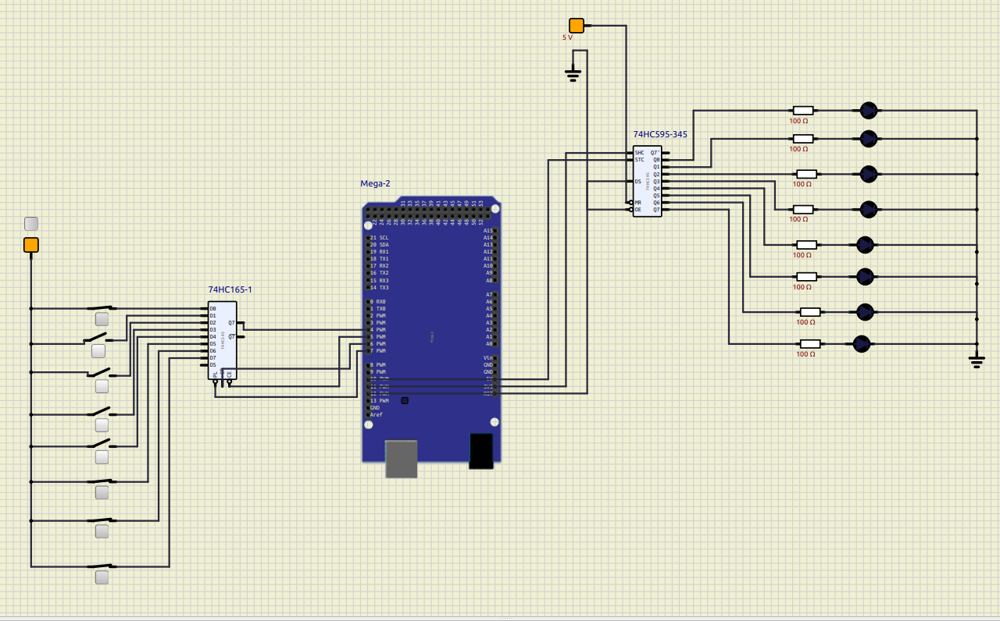

# How to expand Arduino Ports with Shift Registers

This is an example of how expand your [Arduino](https://www.arduino.cc/) pins using shift register ICs. This expansion can work with input or output pins.

`74HC165` was used for input pins.
`74HC595` was used for output pins.

## Compiling

The sample source file of Arduino microcontroller is located at `src/firmware.ino`. Use the Arduino IDE to compile and export its binary as a `.hex` file.

## Simulating

Using [Simulide](https://simulide.com/p/), it is possible to simulate the project. The simulation file is saved at `schematics/schematics.sim1`. After opening it in the simulator, right-click on the Arduino and load the firmware, which is the `.hex` file compiled previously.

